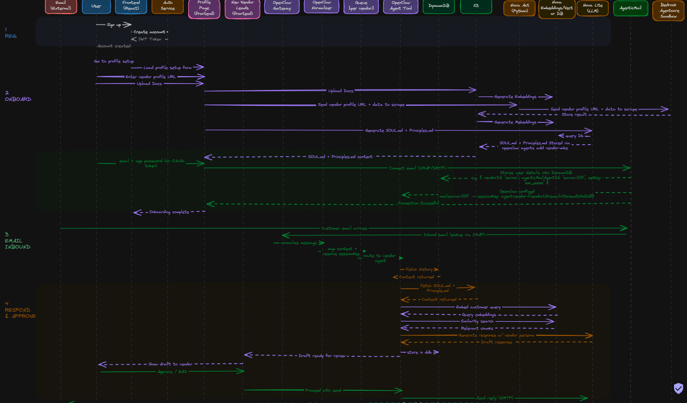

# Vendor Platform Architecture (Email + Phone)

Status: Draft v1  
Source of truth sequence: `plaimages/flow_4.png`

## 1. Purpose

This document is the single architecture reference for the vendor assistant platform.

It combines:
- The email workflow from `plaimages/flow_4.png`.
- The frontend build direction (Oratio scaffold + WeddingOS pages).
- The upcoming phone-call workflow.
- Data design (DynamoDB + S3 + vector storage).
- Backend API structure and implementation timeline.

## 2. Flow Diagram (Current Source of Truth)



Notes:
- The image above is the canonical runtime sequence for email.
- This architecture doc adds component boundaries, storage/API contracts, and deployment details around that sequence.

## 3. Product Scope

Two primary focus areas:

1. Email assistant workflow (priority 1)
- Onboard vendor.
- Ingest vendor context.
- Receive customer emails.
- Generate draft responses.
- Vendor approve/edit or auto-send.

2. Phone-call assistant workflow (priority 2)
- Receive customer phone calls.
- Real-time voice conversation.
- Invoke business logic/context tools.
- Persist transcript and outcomes to same lead/thread model.

Implementation scope for the current build plan:
- Email workflow is in-scope for the first implementation cycle.
- Phone workflow remains documented here as phase-next architecture, but is out-of-scope for the current delivery timeline.

## 4. System Overview

### 4.1 Three-Tier Architecture Diagram (Wedding OS)

```text
+--------------------------------------------------------------------------+
| PRESENTATION TIER                                                        |
|                                                                          |
| Next.js Frontend (Wedding OS Dashboard)                                  |
| - Auth pages (login/register/confirm)                                    |
| - Profile Setup page                                                     |
| - New Leads page                                                         |
| - Existing Leads page                                                    |
| - Settings page (approval mode + integrations)                           |
+--------------------------------------------------------------------------+
                                |
                                | HTTPS REST / WSS
                                v
+--------------------------------------------------------------------------+
| APPLICATION TIER                                                         |
|                                                                          |
| Platform API (FastAPI)                                                   |
| - Auth + vendor onboarding APIs                                          |
| - Leads/threads/messages/drafts APIs                                     |
| - Vendor settings APIs                                                   |
| - Webhook ingress for AgenticMail                                        |
| - Onboarding/workspace sync orchestration                                |
|                                                                          |
| OpenClaw Runtime                                                         |
| - Gateway ingress                                                        |
| - Inbound normalize/finalize                                             |
| - Per-session queue and route                                            |
| - Vendor agent execution and draft generation                            |
+--------------------------------------------------------------------------+
                                |
                                | AWS SDK / provider APIs
                                v
+--------------------------------------------------------------------------+
| DATA & SERVICE TIER                                                      |
|                                                                          |
| DynamoDB                              S3                                 |
| - vendors                              - workspace (SOUL/Principles)     |
| - vendor_mappings                      - docs uploads/processed           |
| - threads/messages/drafts              - onboarding artifacts             |
| - idempotency/delivery/sync tables                                      |
|                                                                          |
| Nova Act + Bedrock Sandbox          Nova Embeddings + Vector Store       |
| Nova Lite (draft generation)        CloudWatch / Secrets / IAM           |
| AgenticMail (IMAP/SMTP/webhook)     ECS/Fargate + OpenClaw host          |
+--------------------------------------------------------------------------+
```

### 4.2 Detailed Architecture Diagram (Wedding OS)

```text
+==========================================================================+
| FRONTEND LAYER                                                           |
+==========================================================================+
| Next.js app (Oratio scaffold adapted for Wedding OS)                     |
| Pages:                                                                    |
| - /login, /register, /confirm                                             |
| - /dashboard/setup                  (Profile Setup)                       |
| - /dashboard/leads/new              (New Leads)                           |
| - /dashboard/leads/existing         (Existing Leads)                      |
| - /dashboard/settings               (Approval + integrations)             |
|                                                                           |
| Frontend API client: calls Platform API only                              |
+==========================================================================+
                                |
                                | HTTPS/WSS
                                v
+==========================================================================+
| PLATFORM API LAYER (FastAPI)                                             |
+==========================================================================+
| Routers:                                                                   |
| - /api/auth/*                                                              |
| - /api/vendors                                                             |
| - /api/vendors/{vendorId}/docs                                             |
| - /api/vendors/{vendorId}/onboarding/*                                     |
| - /api/vendors/{vendorId}/integrations/email/connect                       |
| - /api/vendors/{vendorId}/leads/new                                        |
| - /api/vendors/{vendorId}/leads/existing                                   |
| - /api/vendors/{vendorId}/threads/{threadId}                               |
| - /api/vendors/{vendorId}/threads/{threadId}/drafts/{draftId}/approve      |
| - /api/vendors/{vendorId}/threads/{threadId}/drafts/{draftId}/edit-send    |
| - /api/vendors/{vendorId}/settings                                         |
| - /webhooks/agenticmail/inbound                                            |
|                                                                           |
| Services: AuthService, VendorService, OnboardingService, ThreadService,    |
| DraftService, WorkspaceSyncService                                         |
+==========================================================================+
                                |
                                | runtime dispatch / data IO
                                v
+==========================================================================+
| OPENCLAW RUNTIME LAYER                                                    |
+==========================================================================+
| Inbound (flow_4):                                                          |
| AgenticMail -> OpenClaw connector -> map context + resolve sessionKey      |
|            -> normalize/finalize -> enqueue -> route to vendor agent       |
|                                                                           |
| Runtime components:                                                        |
| - OpenClaw Gateway                                                         |
| - OpenClaw Normalizer                                                      |
| - Queue (per sessionKey)                                                   |
| - OpenClaw Agent Tool                                                      |
|                                                                           |
| Retrieval + generation:                                                    |
| - Fetch thread history + draft context (DynamoDB)                          |
| - Fetch SOUL/Principles (workspace)                                        |
| - Vector retrieval (embeddings)                                            |
| - Draft generation (Nova Lite)                                             |
| - Persist draft + transcript + send outcomes                               |
+==========================================================================+
                                |
                                | AWS SDK / provider APIs
                                v
+==========================================================================+
| DATA & AWS SERVICES LAYER                                                 |
+==========================================================================+
| DynamoDB tables:                                                           |
| - vendors, vendor_mappings, threads, messages, drafts                      |
| - inbound_idempotency, outbound_deliveries, workspace_sync_state           |
|                                                                           |
| S3 prefixes:                                                               |
| - vendors/{vendorId}/workspace/SOUL.md                                     |
| - vendors/{vendorId}/workspace/Principles.md                               |
| - vendors/{vendorId}/docs/uploads/*                                        |
| - vendors/{vendorId}/docs/processed/*                                      |
| - vendors/{vendorId}/onboarding/output/*                                   |
|                                                                           |
| AI/ML services:                                                            |
| - Nova Act + Bedrock AgentCore Sandbox                                     |
| - Nova Embeddings + vector DB                                              |
| - Nova Lite                                                                |
|                                                                           |
| Ops: CloudWatch, Secrets Manager, IAM, ECS/Fargate, OpenClaw host          |
+==========================================================================+
                                |
                                v
+==========================================================================+
| EXTERNAL CHANNEL LAYER                                                    |
+==========================================================================+
| - Customer email clients                                                   |
| - AgenticMail (IMAP pickup, SMTP send, webhook emit)                      |
| - Future phase: phone provider webhook/media stream                        |
+==========================================================================+
```

High-level layers:

1. Frontend layer
- Vendor dashboard UI.
- Profile setup and lead management.
- Frontend calls the Platform API only (no direct OpenClaw calls).

2. Platform API layer
- Business APIs for onboarding, leads, drafts, and vendor settings.
- Webhook/connector ingress endpoints (AgenticMail now, phone later).
- Owns persistence contracts for leads/threads/messages/drafts.

3. OpenClaw runtime layer
- Agent execution, normalize/finalize context, queue, routing, and response orchestration.

4. Data and model layer
- DynamoDB for operational records.
- S3 for vendor workspace artifacts and uploaded docs.
- Embedding model + vector store for retrieval.

5. Cloud infrastructure layer
- AWS deployment for OpenClaw runtime, Platform API services, storage, and observability.

## 5. Frontend Pages and Responsibilities

### 5.1 Technology Decision

**Base**: Oratio's frontend scaffold (Next.js 15.5 + React 18 + Tailwind v4 + shadcn/ui).

**Rationale**: Oratio's auth system, API client with auto-refresh, protected routes, middleware,
and dashboard layout shell are production-ready and complete. Building these from scratch adds
~2 days of work with no product value. Oratio's scaffold is adapted, not forked.

**What is adapted from Oratio (copy with minimal changes):**
- Auth pages: login, register, confirm, forgot-password
- Token management: `lib/auth/token-storage.ts`, `lib/auth/auth-context.tsx`
- API client with auto-refresh: `lib/api/client.ts`
- Protected route guard: `components/auth/protected-route.tsx`
- Next.js middleware: `middleware.ts`
- Dashboard layout shell (sidebar + topbar): `app/dashboard/layout.tsx`
- All shadcn/ui primitives: `components/ui/*`

**What is changed from Oratio:**
- Theme: replace dark oklch CSS variables in `globals.css` with light warm-gray palette
  (`#F9FAFB` backgrounds, `#111827` primary text, `#6B7280` secondary text)
- Font: swap Geist Sans → Inter in `app/layout.tsx`
- Delete Oratio domain pages: `app/agents/`, `app/knowledge-base/`, `app/sessions/`, `app/voice/`

**What is built new (WeddingOS-specific):**
All new pages follow Oratio's routing and component patterns.

Important implementation note:
- `plan/rough_drawings/lead_page_frontend/` is the approved design source.
- We are not rebuilding design from scratch.
- We are converting that existing design into production frontend pages using Oratio's framework and wiring those pages to real backend APIs.

**Design references** (visual target only, not code to port):
- `plan/rough_drawings/lead_page_frontend/` — WeddingOS UI prototype
- `plan/rough_drawings/design_frontend.md` — full design specification

**Implementation guide**: `plan/implementation/FRONTEND_IMPLEMENTATION.md`

### 5.2 Pages and Responsibilities

1. `Profile Setup` — `/dashboard/setup`
- Collect assistant name, vendor URLs, and docs.
- Upload docs to S3 through backend API.
- Connect vendor mailbox integration.
- Trigger onboarding job via `POST /api/vendors/{vendorId}/onboarding/start`.
- Poll status via `GET /api/vendors/{vendorId}/onboarding/status`.
- API calls used by this page:
  - `POST /api/vendors/{vendorId}/docs`
  - `POST /api/vendors/{vendorId}/integrations/email/connect`
  - `POST /api/vendors/{vendorId}/onboarding/start`
  - `GET /api/vendors/{vendorId}/onboarding/status`

**Planned: Right panel — three editable workspace tabs**

The right side of the setup page should surface the vendor's workspace documents
so they can review and manually correct anything the AI generated.

Three tabs:

| Tab | Content | Source | Editable |
|-----|---------|--------|---------|
| **Profile** | Structured fields: studio name, style, location, packages detected, tone, bio | `VendorProfile` JSON scraped by Nova Act — must be persisted to S3 at `vendors/{vendorId}/workspace/profile.json` during `run_onboarding()` | Yes — inline field edits → PUT |
| **SOUL.md** | Full markdown text of the assistant's knowledge base | S3 `vendors/{vendorId}/workspace/SOUL.md` | Yes — textarea → PUT |
| **Principles.md** | Full markdown text of the assistant's behavioural rules | S3 `vendors/{vendorId}/workspace/Principles.md` | Yes — textarea → PUT |

Behaviour notes:
- All three tabs fetch their content on page mount (GET) — if files don't exist yet, show skeleton shimmer.
- During onboarding processing the right panel shows live progress steps (current behaviour); tabs become active after onboarding completes.
- Saving a tab (PUT) writes directly to the S3 workspace path. It does NOT automatically re-trigger onboarding or gate checks — the vendor's manual edits are intentional overrides.
- A "dirty state" indicator (Save button enabled) should prevent accidental overwrite of in-progress generation.

New API endpoints required:
  - `GET  /api/vendors/{vendorId}/workspace/profile`      → `VendorProfile` JSON
  - `PUT  /api/vendors/{vendorId}/workspace/profile`      ← updated field values
  - `GET  /api/vendors/{vendorId}/workspace/soul`         → `{ content: str | null }`
  - `PUT  /api/vendors/{vendorId}/workspace/soul`         ← `{ content: str }`
  - `GET  /api/vendors/{vendorId}/workspace/principles`   → `{ content: str | null }`
  - `PUT  /api/vendors/{vendorId}/workspace/principles`   ← `{ content: str }`

VendorProfile persistence gap (current):
  `NovaActScraper.scrape_urls()` returns a rich `VendorProfile` object (business_name,
  style_keywords, packages, geographic_coverage, description, etc.) but this is
  currently converted to `.to_text()` and discarded after Bedrock generation.
  It must be saved as JSON to S3 so the Profile tab has a data source.

2. `Incoming Leads` — `/dashboard/leads/new`
- Show new inbound threads and AI-generated draft.
- Allow approve/edit/reject per draft.
- API calls:
  - `GET /api/vendors/{vendorId}/leads/new`
  - `GET /api/vendors/{vendorId}/threads/{threadId}`
  - `POST /api/vendors/{vendorId}/threads/{threadId}/drafts/{draftId}/approve`
  - `POST /api/vendors/{vendorId}/threads/{threadId}/drafts/{draftId}/edit-send`

3. `Existing Leads` — `/dashboard/leads/existing`
- Show ongoing conversations and prior thread history.
- Continue same-thread responses and follow-ups.
- API calls:
  - `GET /api/vendors/{vendorId}/leads/existing`
  - `GET /api/vendors/{vendorId}/threads/{threadId}`
  - `POST /api/vendors/{vendorId}/threads/{threadId}/drafts/{draftId}/approve`
  - `POST /api/vendors/{vendorId}/threads/{threadId}/drafts/{draftId}/edit-send`

4. `Settings` — `/dashboard/settings`
- Toggle approval mode (`manual` vs `auto`).
- Manage mailbox/phone integrations.

## 6. Email Runtime Architecture

### 6.1 Inbound execution path

`Customer email -> AgenticMail -> OpenClaw connector ingress -> map context + resolve sessionKey -> normalize/finalize -> enqueue -> route to vendor agent`

Key rule:
- Session key format: `agent:vendor-<vendorId>:email:<threadId>`

### 6.2 What is automatic vs configured

Automatic once context is correctly mapped:
- Context finalization/normalization.
- Queue behavior.
- Route execution by session/agent.
- Duplicate suppression logic.

Must be configured by our platform:
- AgenticMail connector inbound mapping into OpenClaw `MsgContext`.
- `inbox/account -> vendorId` mapping lookup.
- Deterministic `sessionKey` creation.
- Vendor workspace readiness (S3 source-of-truth + runtime cache sync).

Practical interpretation:
- We do not manually re-build normalize/queue logic.
- We do build the connector mapping and vendor/session resolution that feed OpenClaw's native pipeline.

### 6.3 Onboarding to runtime continuity

After onboarding, each vendor should have:
- An OpenClaw agent id (`vendor-<vendorId>`).
- A workspace S3 prefix (`s3://.../vendors/<vendorId>/workspace/`).
- Context files in S3 workspace (at minimum SOUL and rules guidance).
- Runtime sync status proving those files are materialized for OpenClaw runtime reads.
- Mailbox-to-vendor mapping record in DynamoDB.
- Vendor status `active` only after live checks pass.

### 6.4 AgenticMail connector role (explicit)

The AgenticMail connector is a required build component, not optional documentation:
1. Accept inbound AgenticMail events/webhooks.
2. Verify event authenticity.
3. Resolve vendor mapping from account/inbox id.
4. Compute deterministic `sessionKey`.
5. Map payload to OpenClaw `MsgContext`.
6. Dispatch to OpenClaw native runtime path (`normalize -> queue -> route`).

## 7. Phone Workflow Architecture (Phase 2)

Current target model:

1. Telephony ingress
- Phone provider webhook/media stream receives inbound calls.

2. Voice bridge service
- Runs low-latency call session orchestration.
- Uses Nova Sonic for bidirectional voice interaction.

3. Business logic integration
- Voice workflow invokes OpenClaw agent/tool path for vendor-specific logic and context retrieval.

4. Unified persistence
- Persist call transcript + summary into same lead/thread data model in DynamoDB.

Outcome:
- Email and phone share vendor identity, memory, and lead tracking model.

## 8. Backend API Structure

The backend should expose a platform API in front of OpenClaw.
OpenClaw gateway remains the agent runtime service, not the only business API.

### 8.1 Auth Implementation

**Auth backend**: AWS Cognito (User Pool + JWT RS256 JWKS validation).
**Token lifecycle**: Access token 1hr, ID token 1hr, refresh token 30 days.
**Auto-refresh**: Handled transparently by `lib/api/client.ts` on every request.
**Storage**: Cookies (set by frontend, not httpOnly — sufficient for MVP).

Full implementation contracts (endpoints, Cognito flow, DI pattern, middleware):
- `plan/implementation/AUTHENTICATION_IMPLEMENTATION.md` — all 8 auth endpoints
- `plan/implementation/DEPENDENCY_INJECTION.md` — FastAPI `Depends()` pattern for all services
- `plan/implementation/MIDDLEWARE_AND_PROTECTION.md` — frontend token storage + protected routes

### 8.2 API groups

1. Auth and user
- `POST /api/auth/register`
- `POST /api/auth/confirm`
- `POST /api/auth/login`
- `POST /api/auth/refresh`
- `GET /api/auth/me`
- `POST /api/auth/logout`
- `POST /api/auth/forgot-password`
- `POST /api/auth/reset-password`

2. Vendor onboarding
- `POST /api/vendors`
- `POST /api/vendors/{vendorId}/docs`
- `POST /api/vendors/{vendorId}/onboarding/start`
- `GET /api/vendors/{vendorId}/onboarding/status`
- `POST /api/vendors/{vendorId}/integrations/email/connect`
- `POST /api/vendors/{vendorId}/integrations/phone/connect` (phase-2 endpoint, not required for current email implementation cycle)

3. Leads, threads, messages, drafts
- `GET /api/vendors/{vendorId}/leads/new`
- `GET /api/vendors/{vendorId}/leads/existing`
- `GET /api/vendors/{vendorId}/threads/{threadId}`
- `POST /api/vendors/{vendorId}/threads/{threadId}/drafts/{draftId}/approve`
- `POST /api/vendors/{vendorId}/threads/{threadId}/drafts/{draftId}/edit-send`

4. Vendor settings
- `GET /api/vendors/{vendorId}/settings`
- `PATCH /api/vendors/{vendorId}/settings` (approval mode, channel toggles)

5. Ingress webhooks (internal/system)
- `POST /webhooks/agenticmail/inbound`
- `POST /webhooks/phone/inbound`

Page/API mapping note:
- `Incoming Leads` and `Existing Leads` use different list endpoints (`/leads/new` vs `/leads/existing`).
- Both pages share the same thread-detail and draft-action endpoints.

### 8.3 OpenClaw runtime interaction

Platform API/service calls OpenClaw for:
- Inbound dispatch to vendor agent.
- Approval/send actions.
- Agent operations and health checks.

## 9. DynamoDB Data Model

## 9.1 Required tables for email/OpenClaw compatibility (MVP)

1. `vendors`
- PK: `vendorId`
- Fields: `agentId`, `workspaceS3Prefix`, `approvalMode`, `status`, `mailboxConfig`, `phoneConfig`, `createdAt`, `updatedAt`
- Notes: `status` only moves to `active` after live checks pass.

2. `vendor_mappings`
- PK: `integrationType#accountId`
- SK: `vendorId`
- Fields: `mailboxAddress`, `provider`, `agentId`, `active`, `createdAt`, `updatedAt`
- Purpose: fast inbound `accountId/inboxId -> vendorId` routing.

3. `threads`
- PK: `vendorId`
- SK: `threadId`
- Fields: `sessionKey`, `channel` (`email|phone`), `state`, `lastMessageAt`, `lastDirection`, `draftStatus`, `provider`, `accountId`, `providerThreadId`, `lastProviderMessageId`
- Notes: deterministic key `agent:vendor-<vendorId>:email:<threadId>`.

4. `messages`
- PK: `vendorId#threadId`
- SK: `messageTs#messageId`
- Required compatibility fields: `direction`, `channel`, `body`, `provider`, `accountId`, `providerMessageId`, `providerThreadId`, `originatingChannel`, `originatingTo`, `sessionKey`, `messageThreadId`, `from`, `to`, `inReplyTo`, `references`, `meta`, `createdAt`
- Notes: keep routing/threading fields as first-class attributes for replay/debug.

5. `drafts`
- PK: `vendorId#threadId`
- SK: `draftId`
- Fields: `content`, `status`, `createdAt`, `approvedAt`, `sentAt`, `createdBy`, `modelId`, `contextRefs`
- Status flow (persisted): `pending_review -> approved -> sent` (manual) or `auto_sent` (auto mode).
  `generated` may exist as a transient pre-persist runtime phase before write-back.

6. `inbound_idempotency` (new, required)
- PK: `dedupeKey` (`provider|accountId|sessionKey|peer|threadId|messageId`)
- Fields: `vendorId`, `threadId`, `messageId`, `provider`, `accountId`, `firstSeenAt`, `ttl`
- Purpose: durable duplicate suppression across retries/restarts.

7. `outbound_deliveries` (new, required)
- PK: `vendorId#threadId`
- SK: `sendTs#sendId`
- Fields: `draftId`, `status` (`pending|sending|sent|failed`), `provider`, `accountId`, `providerMessageId`, `providerThreadId`, `inReplyTo`, `references`, `attemptCount`, `lastError`, `createdAt`, `updatedAt`
- Purpose: thread-safe retries and send reconciliation without duplicate customer sends.

8. `workspace_sync_state` (new, required)
- PK: `vendorId`
- SK: `workspace`
- Fields: `workspaceS3Prefix`, `soulEtag`, `principlesEtag`, `lastSyncedAt`, `syncStatus`, `runtimeHost`
- Purpose: guard S3 -> local workspace sync before runtime turns.

## 9.2 Suggested indexes

1. `threads` GSI: `vendorId#state + lastMessageAt` (new/existing lead views).
2. `drafts` GSI: `vendorId#status + createdAt` (review queues).
3. `messages` GSI: `provider#accountId + providerMessageId` (provider-safe idempotency lookup).
4. `messages` GSI: `vendorId#sessionKey + messageTs` (session replay/debug).
5. `outbound_deliveries` GSI: `vendorId#status + updatedAt` (retry worker queue).

## 9.3 Optional but recommended tables

1. `onboarding_checks`
- PK: `vendorId`
- SK: `runId`
- Fields: per-check results (`mailbox`, `mapping`, `sessionKey`, `openclaw`, `threading`), `result`, `createdAt`
- Purpose: promote `vendor.status=active` only after explicit live checks.

2. `audit_events`
- PK: `vendorId`
- SK: `eventTs#eventId`
- Fields: `type`, `actor`, `entity`, `entityId`, `payloadSummary`
- Purpose: incident/debug trail across inbound, draft, approve, send.

## 10. S3 Design and Workspace Sync

## 10.1 Bucket layout

`s3://<bucket>/vendors/<vendorId>/`

Recommended prefixes:
- `workspace/SOUL.md`
- `workspace/AGENTS.md`
- `workspace/Principles.md`
- `docs/uploads/*`
- `docs/processed/*`
- `onboarding/output/*`

## 10.2 Important runtime rule

OpenClaw runtime reads bootstrap context from local workspace files.
Therefore, we need an explicit sync step from S3 to local workspace for each vendor agent.

Workspace ownership model:
- S3 is the vendor workspace source of truth ("workspace bench").
- Local OpenClaw workspace is an execution cache/materialization layer.
- Runtime must never be treated as the long-term source of truth.

Required sync behavior:
- On vendor activation.
- On workspace file update (SOUL/rules changes).
- On service startup/recovery.

## 10.3 Sample AWS stack gap

The current `sample-OpenClaw-on-AWS-with-Bedrock/clawdbot-bedrock.yaml` is a base OpenClaw deployment template.
It does not define vendor-specific S3, DynamoDB, or onboarding orchestration resources.
Those need to be added in our platform stack.

## 11. Retrieval and Embeddings

### 11.1 Onboarding document embeddings (current)

1. Onboarding docs and extracted profile content are chunked.
2. Chunks are embedded with Nova Embeddings.
3. Vectors are stored in chosen vector store (current plan: OpenClaw SQLite/sqlite-vec path).
4. Inbound retrieval must filter by `vendorId` before ranking.

### 11.2 Past Behaviour RAG Pipeline (next phase)

#### Problem

SOUL.md and Principles.md give the agent facts and rules, but not *examples of what worked before*.
Wedding vendors have years of institutional knowledge in their inboxes, WhatsApp threads,
Messenger conversations, and Instagram DMs — how they handled awkward pricing questions, what
tone convinced a hesitant couple to book, how they responded to a cancellation.
Without surfacing this, the agent starts from scratch on every inquiry.

The frontend already surfaces a "Referencing previous conversations" indicator in the thread
detail panel. This section defines the backend pipeline that makes that signal real.

#### Design

```
INGESTION (one-time per vendor + incremental updates)
─────────────────────────────────────────────────────
Past conversations scraped from:
  - Email (IMAP/AgenticMail export — already integrated)
  - WhatsApp Business API conversation export
  - Facebook Messenger Graph API export
  - Instagram DM Graph API export
        ↓
Chunked into one "situation" per conversation thread
Each chunk tagged with:
  - vendorId (for mandatory tenant isolation)
  - channel (email / whatsapp / messenger / instagram)
  - outcome ("booked" | "not_booked" | "unknown")
  - booking_date (if outcome=booked, YYYY-MM-DD)
  - timestamp (approximate date of conversation)
        ↓
Nova Embeddings → vector
        ↓
Stored in sqlite-vec with vendorId filter index

S3 raw source:
  vendors/{vendorId}/past-behaviours/{channel}/{conversationId}.json
```

```
RETRIEVAL (per inbound email, at agent prompt assembly time)
────────────────────────────────────────────────────────────
New customer message arrives
        ↓
Embed the customer's opening message → query vector
        ↓
Similarity search against that vendor's past-behaviour chunks
(MUST filter by vendorId — never cross-tenant results)
        ↓
Top-3 most similar past situations returned
Preference given to chunks where outcome=booked (converted situations)
        ↓
Injected into agent prompt as a "Similar past situations" section:

  "Similar past situations this vendor has handled:
   1. [2024-08-12, booked] Couple inquired about outdoor ceremony for 80 guests,
      budget £4,000. Vendor offered venue tour + package comparison. Resulted in booking.
   2. [2024-03-05, not_booked] Couple asked about October availability. Vendor was
      unavailable for that date. Suggested alternate vendors.
   3. ..."
```

#### OpenClaw wiring

A fourth tool is added to the vendor workspace alongside the existing three:

```
Tool: get_similar_situations
  Parameters: vendor_id (string), customer_message (string), limit (int, default 3)
  Returns: array of {summary, channel, outcome, booking_date, timestamp}
  Implementation: POST /api/internal/vendors/{vendorId}/similar-situations
```

AGENTS.md instruction added:
> After reading SOUL.md and Principles.md but before drafting a reply, call
> `get_similar_situations` with the customer's message. Use the returned examples
> to inform your tone and approach — especially examples where outcome=booked.

#### Why RAG and not a flat PAST_BEHAVIOURS.md

| Approach | Problem |
|----------|---------|
| Flat `PAST_BEHAVIOURS.md` in workspace | OpenClaw's bootstrap file loader has character limits. 3 years of conversations = 100k+ words. Most would be truncated and never seen by the model. |
| Embed all into system prompt | Same problem — context window overflow. |
| RAG (this design) | Only the 3 most *relevant* past situations are injected per request. Scales to any history size. No truncation. |

#### Key constraints

- Tenant isolation is mandatory: all vector queries MUST include `vendorId` filter. Cross-vendor retrieval is a data leak.
- Outcome tagging matters: prioritise `booked` outcomes to give the agent examples of what converted.
- Incremental updates: new bookings should be ingested into the vector store after they close, not just at setup.
- Chunking unit = one conversation thread (not one message). Individual messages lack context.

#### S3 layout addition

```
vendors/{vendorId}/past-behaviours/
  email/
    {conversationId}.json    ← raw scraped thread
  whatsapp/
    {conversationId}.json
  messenger/
    {conversationId}.json
  instagram/
    {conversationId}.json
```

#### Open questions (to resolve before implementation)

1. **Consent and privacy**: vendor must explicitly opt in to past-behaviour scraping per platform.
2. **WhatsApp/Messenger/Instagram auth**: requires Business API access — not all vendors will have it. Email is the fallback baseline.
3. **Incremental vs full re-embed**: on each new booking, re-embed the closing thread and add it to the store. Full re-embed only needed when chunking strategy changes.
4. **Outcome inference**: for older conversations, outcome may need to be inferred from the thread (did they discuss a date and stop replying? did a booking confirmation message appear?). Nova Lite can classify outcome on ingestion.

## 12. Infrastructure Deployment Plan (AWS)

## 12.1 Base deployment

Start from sample OpenClaw stack:
- `sample-OpenClaw-on-AWS-with-Bedrock/clawdbot-bedrock.yaml`

## 12.2 Platform additions

Add:
1. S3 bucket(s) for vendor artifacts and documents.
2. DynamoDB tables defined above.
3. Onboarding worker/orchestrator (Lambda or container + optional Step Functions).
4. Platform API service (auth, vendor config, leads/drafts APIs).
5. Webhook ingress for AgenticMail and phone provider.
6. Optional queue/event components for durability and retries.

## 12.3 Environment split

Use at least:
- `dev`
- `staging`
- `prod`

With isolated:
- Buckets
- DynamoDB tables
- Secrets
- Gateway tokens

## 12.4 Hosting strategy (current recommendation)

1. OpenClaw runtime
- Use `sample-OpenClaw-on-AWS-with-Bedrock` as baseline deployment path.
- Current sample deploys OpenClaw on EC2 with Docker + SSM, not ECS Fargate.

2. Platform API + workers
- Deploy as containerized services on ECS Fargate (aligned with Oratio operational model).
- Frontend and backend remain decoupled, with frontend calling Platform API only.

3. Frontend hosting
- Use ECS Fargate deployment pattern similar to Oratio for consistency.
- Alternative hosting can be evaluated later, but not required for current scope.

4. If/when moving OpenClaw to Fargate
- Add persistent shared storage (EFS) for workspace/session/memory paths.
- Do not rely on Fargate ephemeral storage for OpenClaw stateful runtime needs.

## 13. Commands and Operational Checks

Core checks:
1. `openclaw health --json`
2. `openclaw agents list --bindings`
3. `openclaw channels status --probe`
4. `openclaw plugins list`

Per-vendor onboarding completion checks:
1. Agent exists and mapped.
2. Workspace files are synced locally.
3. Inbound event resolves deterministic session key.
4. Draft persists for a test inbound message.
5. Vendor status flips to `active`.

## 13.1 E2E Validation Checklist (`flow_4` execution gate)

The project is not implementation-complete until all checks below pass in sequence.

1. Registration and auth
- Vendor user can sign up/login and access dashboard pages.

2. Onboarding storage
- `SOUL.md` and `Principles.md` are generated and present in:
  - `s3://<bucket>/vendors/<vendorId>/workspace/SOUL.md`
  - `s3://<bucket>/vendors/<vendorId>/workspace/Principles.md`

3. Vendor mapping and runtime readiness
- `vendor_mappings` record resolves mailbox/account to `vendorId`.
- Workspace sync state is healthy for vendor runtime use.
- Vendor status transitions to `active` only after onboarding checks pass.

4. Inbound path correctness
- Real inbound email follows only:
  - `AgenticMail -> OpenClaw connector -> normalize/finalize -> enqueue -> route`
- No parallel duplicate ingress path is active.

5. Session continuity
- Same provider thread resolves to same `sessionKey`:
  - `agent:vendor-<vendorId>:email:<threadId>`

6. Draft generation and persistence
- One inbound email produces one draft record linked to correct `vendorId` + `threadId`.
- Draft and transcript are persisted in DynamoDB.

7. Frontend visibility
- Draft appears in `New Leads` page.
- Thread appears in `Existing Leads` after interaction continues.

8. Manual/auto response behavior
- Manual mode: approve/edit-send works end-to-end.
- Auto mode: draft is auto-approved and sent without dashboard action.

9. Thread-safe outbound send
- Outbound reply stays in original email thread (`In-Reply-To`, `References`).
- `outbound_deliveries` reflects send outcome (`sent` or `failed`) with metadata.

10. Duplicate inbound resilience
- Replayed inbound webhook event does not create duplicate draft/send outcome.

11. Traceability
- A single correlation id can trace ingress -> normalize -> draft -> send outcome in logs.

12. Final pass criterion
- Steps 1-11 pass for at least one fully onboarded vendor using the exact `flow_4` path.

## 14. Implementation Timeline (2 Weeks, Email Scope)

## Week 1: Core infrastructure and email runtime

### Days 1-2: Foundation
1. Set up backend + frontend project structure.
2. Provision AWS resources (DynamoDB tables above + S3 prefixes + secrets).
3. Implement auth (JWT/Cognito contracts, password hashing where applicable).
4. Build base CRUD APIs for vendors, mappings, threads, drafts.

Deliverable:
- Dev environment running with auth, vendor records, and table contracts live.

### Days 3-4: Onboarding pipeline
1. Build profile/docs onboarding orchestration.
2. Run Nova Act extraction + SOUL/Principles generation.
3. Write workspace artifacts to S3 and trigger workspace sync.
4. Persist onboarding + mapping status and live-check results.

Deliverable:
- Vendor can complete profile setup and transition to `active` through checks.

### Days 5-7: Email inbound + draft flow
1. Implement AgenticMail native connector mapping to OpenClaw `MsgContext`.
2. Enforce deterministic `sessionKey` derivation and vendor mapping resolution.
3. Wire normalize -> queue -> route path through OpenClaw runtime.
4. Persist messages/drafts and apply inbound idempotency + outbound delivery tracking.
5. Enforce outbound email threading metadata (`In-Reply-To`, `References`).

Deliverable:
- Inbound email produces vendor-scoped draft with reliable threading and dedupe behavior.

## Week 2: Frontend, reliability, and demo readiness

### Days 8-10: Frontend pages
1. Implement `Profile Setup` page (onboarding trigger + status polling).
2. Implement `Incoming Leads` page (new threads + draft actions).
3. Implement `Existing Leads` page (ongoing thread history + follow-ups).
4. Implement `Settings` page (`manual/auto` approval, integration toggles).

Deliverable:
- Frontend reflects all entities from `flow_4` and supports draft review/send loop.

### Days 11-12: Monitoring and live checks
1. Add live onboarding checks (mailbox, mapping, session key, runtime acceptance, threading smoke).
2. Add dashboards/logging for vendor/thread pipeline visibility.
3. Add retry workflows and failure alerts for inbound/outbound paths.

Deliverable:
- Operators can prove onboarding and runtime health before production traffic.

### Days 13-14: Testing, polish, and demo
1. End-to-end tests for onboarding, inbound, draft approve/edit-send, and thread continuity.
2. Load/retry tests for duplicate inbound and reordered delivery.
3. Bug fixing, documentation, and demo prep.

Deliverable:
- Production-ready MVP for email, with phone workflow staged as phase-next.

## 14.1 Component checklist to generate

Backend components:
1. Platform API service (`auth`, `vendors`, `leads`, `draft actions`, `settings`).
2. AgenticMail connector ingress (mapping + validation).
3. Onboarding worker(s) for profile extraction and workspace materialization.
4. Workspace sync worker (S3 -> OpenClaw local workspace).
5. Reliability workers (idempotency enforcement, outbound retry reconciliation).

Frontend components:
1. `Profile Setup` tab.
2. `New Leads` tab.
3. `Existing Leads` tab.
4. `Settings` integrations tab.

Data/infrastructure components:
1. DynamoDB tables and GSIs in section 9.
2. S3 vendor prefix layout in section 10.
3. Secrets and runtime config management.
4. CloudWatch metrics/logs/alerts.

## 15. Success Criteria

The implementation is successful when all criteria below pass in `dev` and `staging`:

1. Vendor onboarding reaches `active` only after live checks pass (mapping, session key, runtime acceptance, threading smoke).
2. Inbound email for a known vendor produces exactly one thread-linked draft per unique provider message id.
3. Duplicate inbound deliveries do not create duplicate drafts or duplicate send operations.
4. Session continuity is preserved: same `vendorId + threadId` always resolves to the same `sessionKey`.
5. Outbound replies remain in the original provider thread (`In-Reply-To` + `References` enforced).
6. Draft workflow works end-to-end: `pending_review -> approved/edit-send -> sent` (manual) or `auto_sent` (auto).
7. Frontend tabs are fully functional: `Profile Setup`, `New Leads`, `Existing Leads`, `Settings`.
8. Cross-vendor isolation is validated (no thread/message leakage across vendors).
9. Workspace sync health is passing (`SOUL.md` and `Principles.md` available to runtime before processing).
10. Observability is in place: logs and metrics can trace one email from ingress through send outcome.

## 16. Open Questions

1. Final phone provider selection and exact voice bridge runtime.
2. Final vector storage mode in production.
3. Whether `Principles.md` is merged into `AGENTS.md` for runtime injection or supported as separate injected file.
4. SLA targets for reply latency and call handoff behavior.

## 17. Related Documents

- `plan/vendor-email-agent-sequence.md`
- `plan/agenticmail-openclaw-connector-implementation.md`
- `plan/openclaw-phone-sms-nova.md`
- `plan/implementation/EMAIL_OPENCLAW_DYNAMODB_CRITICAL_REVIEW.md`
- `plan/implementation/EMAIL_OPENCLAW_COMPONENT_PLAN_2_WEEKS.md`
- `plan/discussions/04-email-flow-and-rag.md`
- `plan/discussions/05-storage-architecture.md`
- `plan/rough_drawings/lead_page_frontend/` — WeddingOS UI prototype (design reference only)
- `plan/rough_drawings/design_frontend.md` — full design specification
- `plan/implementation/FRONTEND_IMPLEMENTATION.md` — frontend scaffold guide
- `plan/implementation/AUTHENTICATION_IMPLEMENTATION.md` — auth contracts
