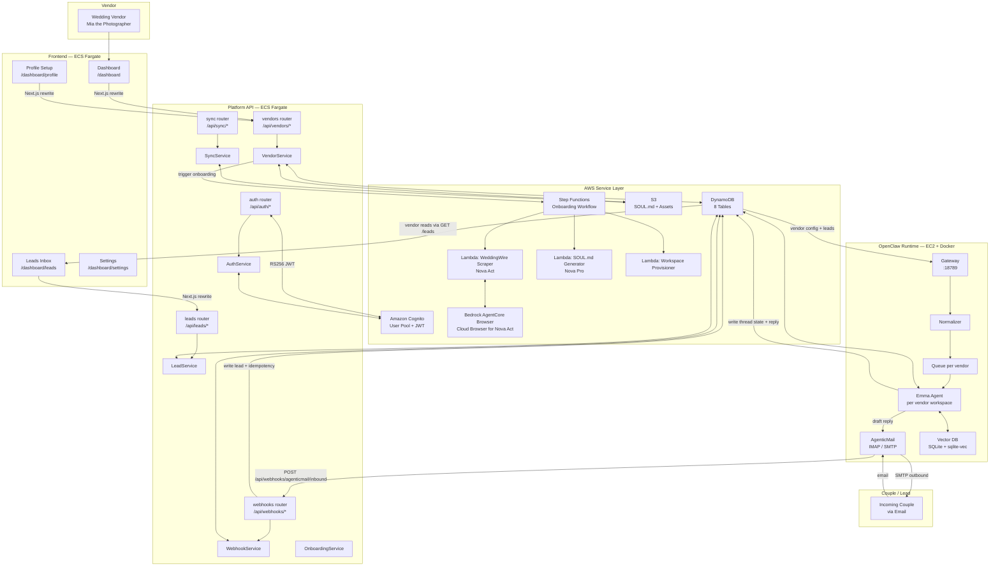
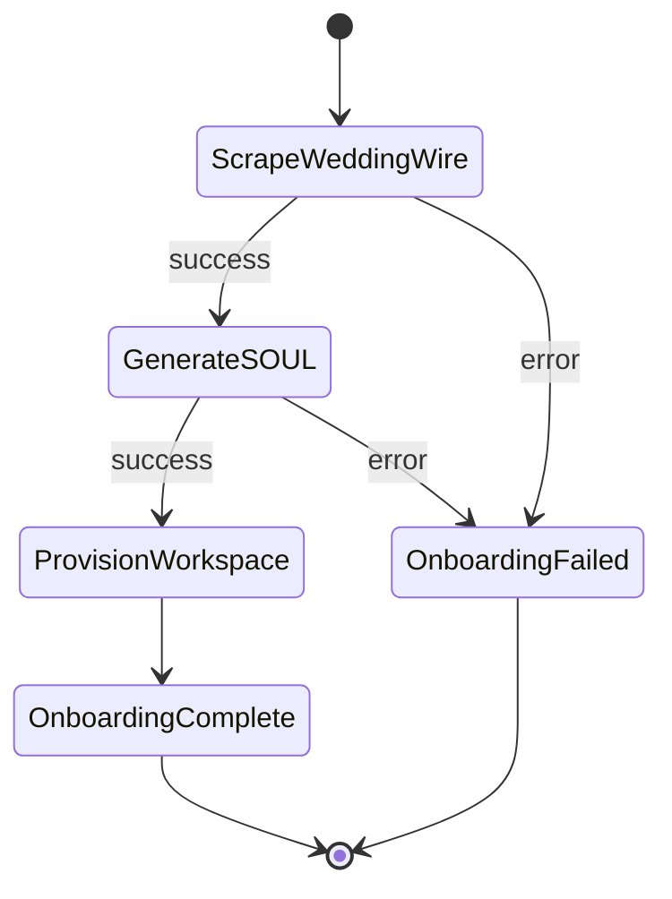
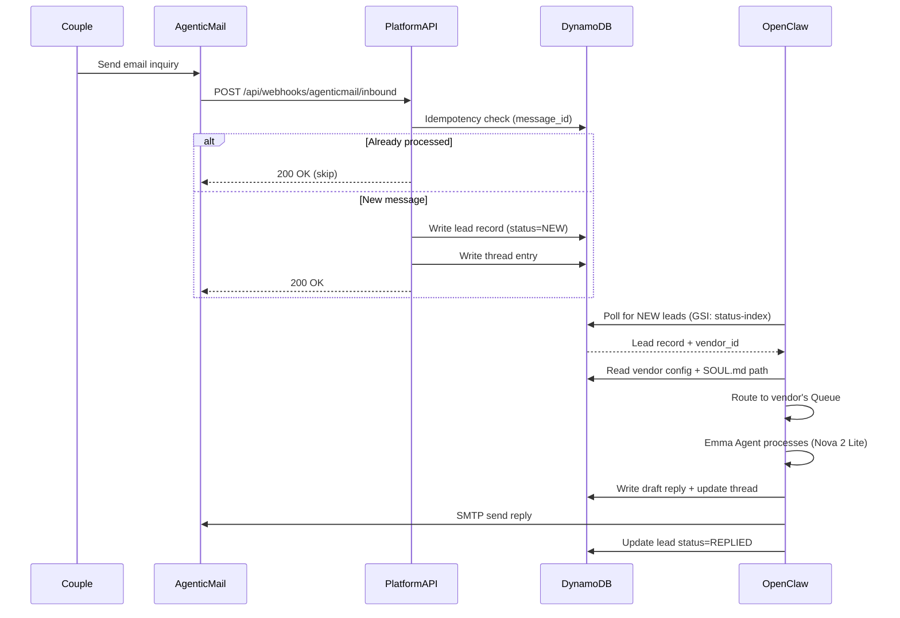

# WeddingOS Backend Architecture

**Emma** — AI Studio Manager for wedding vendors, answering inquiries and booking consultations 24/7.

**Hackathon:** Amazon Nova AI Hackathon
**Scope:** Email-first (Phase 1). Voice (Phase 2 placeholder).

---

## Table of Contents

1. [Architecture Overview](#1-architecture-overview)
2. [Detailed Architecture Diagram](#2-detailed-architecture-diagram)
3. [Layer 1 — Frontend (Next.js)](#3-layer-1--frontend-nextjs)
4. [Layer 2 — Platform API (FastAPI)](#4-layer-2--platform-api-fastapi)
5. [Layer 3 — AWS Service Layer](#5-layer-3--aws-service-layer)
6. [Layer 4 — OpenClaw Runtime Service](#6-layer-4--openclaw-runtime-service)
7. [Cross-Cutting: Shared DynamoDB Pattern](#7-cross-cutting-shared-dynamodb-pattern)
8. [Endpoint Reference](#8-endpoint-reference)
9. [DynamoDB Table Reference](#9-dynamodb-table-reference)
10. [Deployment Architecture](#10-deployment-architecture)

---

## 1. Architecture Overview

WeddingOS has **four layers** that each have a distinct responsibility boundary:

```
┌─────────────────────────────────────────────────────────────────┐
│  LAYER 1 — FRONTEND (Next.js 15.5)                              │
│  Vendor dashboard · Auth pages · Leads inbox · Profile setup    │
│  Calls Platform API only (via Next.js rewrites, no CORS)        │
└─────────────────────────────────────────────────────────────────┘
                              │
                              ▼  REST + JWT
┌─────────────────────────────────────────────────────────────────┐
│  LAYER 2 — PLATFORM API (FastAPI)                               │
│  auth · vendors · leads · webhooks · sync                       │
│  Owns all vendor data + orchestrates AWS services               │
└─────────────────────────────────────────────────────────────────┘
          │                   │                   │
          ▼                   ▼                   ▼
┌─────────────────┐  ┌─────────────────┐  ┌──────────────────────┐
│  LAYER 3        │  │  LAYER 3        │  │  LAYER 3             │
│  AWS COGNITO    │  │  DynamoDB + S3  │  │  Step Functions +    │
│  Auth + JWT     │  │  Data + Files   │  │  Lambda Workers      │
└─────────────────┘  └─────────────────┘  └──────────────────────┘
                              │
                              ▼  Shared DynamoDB (no direct HTTP)
┌─────────────────────────────────────────────────────────────────┐
│  LAYER 4 — OPENCLAW RUNTIME SERVICE (TypeScript / Node.js)      │
│  AgenticMail → Gateway → Normalizer → Queue → Agent             │
│  Reads leads + vendor config from DynamoDB                      │
│  Writes agent replies + thread state back to DynamoDB           │
└─────────────────────────────────────────────────────────────────┘
```

### Key Design Principles

| Principle | Implementation |
|---|---|
| **Thin routers** | Routers validate input and delegate — no business logic |
| **Service layer** | All business logic lives in service classes |
| **Dependency injection** | FastAPI `Depends()` chain — testable, swappable |
| **Shared database** | Platform API and OpenClaw communicate via DynamoDB only |
| **S3 source of truth** | SOUL.md (vendor identity file) lives in S3; OpenClaw local workspace is a cache |

---

## 2. Detailed Architecture Diagram



---

## 3. Layer 1 — Frontend (Next.js)

See [FRONTEND_IMPLEMENTATION.md](./implementation/FRONTEND_IMPLEMENTATION.md) for the full guide.

**Quick summary:**
- Based on Oratio scaffold (Next.js 15.5, Tailwind v4, shadcn/ui)
- Light theme reskin via CSS variable replacement in `globals.css`
- WeddingOS pages built new; Oratio auth pages copied + adapted

**API calls:**
All calls go to `/api/*` locally and are rewritten by Next.js to the Platform API backend URL. The backend URL is a **server-side env var** (`PLATFORM_API_URL`) — never baked into the client bundle. This eliminates CORS and allows the same Docker image to be promoted from staging to production.

---

## 4. Layer 2 — Platform API (FastAPI)

### 4.1 File Structure

```
backend/
├── main.py                    # App factory, CORS, router registration
├── config.py                  # pydantic-settings BaseSettings, all env vars
├── dependencies.py            # DI chain: get_cognito_client → get_auth_service → get_current_user
│
├── routers/
│   ├── auth.py                # /api/auth/* (8 endpoints)
│   ├── vendors.py             # /api/vendors/* (6 endpoints)
│   ├── leads.py               # /api/leads/* (4 endpoints)
│   ├── webhooks.py            # /api/webhooks/* (2 endpoints)
│   └── sync.py                # /api/sync/* (2 endpoints)
│
├── services/
│   ├── auth_service.py        # Cognito sign-up, login, token refresh
│   ├── vendor_service.py      # Vendor profile CRUD + onboarding trigger
│   ├── lead_service.py        # Lead ingestion, status, thread management
│   ├── webhook_service.py     # AgenticMail inbound parsing + idempotency
│   ├── sync_service.py        # SOUL.md S3 sync to OpenClaw workspace
│   └── onboarding_service.py  # WeddingWire scrape → SOUL.md → Step Functions
│
└── aws/
    ├── cognito_client.py      # boto3 cognito-idp wrapper
    ├── dynamodb_client.py     # Generic table-agnostic DynamoDB wrapper
    └── s3_client.py           # SOUL.md + asset upload/download
```

### 4.2 Dependency Injection Chain

```python
# dependencies.py

def get_cognito_client() -> CognitoClient:
    return CognitoClient()

def get_auth_service(
    cognito_client: Annotated[CognitoClient, Depends(get_cognito_client)]
) -> AuthService:
    return AuthService(cognito_client=cognito_client)

def get_current_user(
    token: str,
    auth_service: Annotated[AuthService, Depends(get_auth_service)]
) -> dict:
    return auth_service.verify_token(token)  # Validates Cognito RS256 JWT
```

Every route that needs auth takes `current_user: Annotated[dict, Depends(get_current_user)]` as a parameter. FastAPI resolves the whole chain automatically.

### 4.3 Router Pattern (Thin Routers)

Routers **only**:
1. Accept the request
2. Call the service
3. Return the response

```python
# routers/vendors.py
@router.post("/{vendor_id}/onboard", status_code=202)
async def trigger_onboarding(
    vendor_id: str,
    payload: OnboardPayload,
    current_user: Annotated[dict, Depends(get_current_user)],
    vendor_service: Annotated[VendorService, Depends(get_vendor_service)],
):
    job_id = await vendor_service.start_onboarding(vendor_id, payload.weddingwire_url)
    return {"job_id": job_id, "status": "queued"}
```

### 4.4 Config Pattern

```python
# config.py
class Settings(BaseSettings):
    # AWS
    AWS_REGION: str = "us-east-1"

    # Cognito
    COGNITO_USER_POOL_ID: str
    COGNITO_CLIENT_ID: str

    # DynamoDB tables
    VENDORS_TABLE: str = "weddingos-vendors"
    LEADS_TABLE: str = "weddingos-leads"
    THREADS_TABLE: str = "weddingos-threads"
    INBOUND_IDEMPOTENCY_TABLE: str = "weddingos-inbound-idempotency"
    OUTBOUND_DELIVERIES_TABLE: str = "weddingos-outbound-deliveries"
    ONBOARDING_TABLE: str = "weddingos-onboarding-jobs"
    WORKSPACE_SYNC_TABLE: str = "weddingos-workspace-sync"
    AUDIT_TABLE: str = "weddingos-audit"

    # S3
    SOUL_BUCKET: str = "weddingos-souls"

    # Step Functions
    ONBOARDING_STATE_MACHINE_ARN: str

    # OpenClaw
    OPENCLAW_WORKSPACE_PATH: str = "/workspaces"

    model_config = SettingsConfig(env_file=".env")

settings = Settings()
```

---

## 5. Layer 3 — AWS Service Layer

### 5.1 Amazon Cognito

**Role:** Identity provider — creates users, issues JWTs, manages sessions.

**Pattern copied from Oratio:**
- User pool with password policy + email verification
- Tokens: access (1h) + ID (1h) + refresh (30d)
- JWT validation uses **Cognito JWKS endpoint** (RS256) — no local secret key
- Token refresh: client sends refresh token → `initiate_auth(REFRESH_TOKEN_AUTH)` → new access + ID tokens

```python
# aws/cognito_client.py
class CognitoClient:
    def __init__(self, cognito_client=None, user_pool_id=None, client_id=None):
        self.client = cognito_client or boto3.client('cognito-idp')
        self.user_pool_id = user_pool_id or settings.COGNITO_USER_POOL_ID
        self.client_id = client_id or settings.COGNITO_CLIENT_ID

    def sign_up(self, email, password, name): ...
    def confirm_sign_up(self, email, code): ...
    def initiate_auth(self, email, password): ...  # Returns tokens
    def refresh_token(self, refresh_token): ...
    def get_user(self, access_token): ...
    def global_sign_out(self, access_token): ...
    def forgot_password(self, email): ...
    def confirm_forgot_password(self, email, code, new_password): ...
```

### 5.2 DynamoDB

**Pattern:** One generic `DynamoDBClient` that all services use — table-agnostic wrapper. Services pass the table name and compose GSI queries themselves.

```python
# aws/dynamodb_client.py
class DynamoDBClient:
    def __init__(self, table_name: str, dynamodb_resource=None):
        self.dynamodb = dynamodb_resource or boto3.resource('dynamodb')
        self.table = self.dynamodb.Table(table_name)

    def put_item(self, item: dict) -> dict: ...
    def get_item(self, key: dict) -> Optional[dict]: ...
    def update_item(self, key, update_expr, attr_values): ...
    def delete_item(self, key: dict): ...
    def query(self, key_condition, index_name=None, **kwargs): ...
    def scan(self, filter_expression=None, **kwargs): ...
```

Each service instantiates its own client:
```python
class VendorService:
    def __init__(self):
        self.vendors = DynamoDBClient(settings.VENDORS_TABLE)
        self.onboarding = DynamoDBClient(settings.ONBOARDING_TABLE)
```

### 5.3 S3 — SOUL.md and Assets

**Role:** Source of truth for vendor identity files. OpenClaw local workspaces are execution caches.

```
s3://weddingos-souls/
├── {vendor_id}/
│   ├── SOUL.md                   # Emma's identity + SOP for this vendor
│   ├── portfolio/                # Wedding photos (Nova Embeddings input)
│   └── knowledge/                # Pricing PDFs, FAQs, contracts
```

```python
# aws/s3_client.py
class S3Client:
    def upload_soul(self, vendor_id: str, content: str): ...
    def download_soul(self, vendor_id: str) -> str: ...
    def upload_asset(self, vendor_id: str, key: str, data: bytes): ...
    def list_assets(self, vendor_id: str) -> list[str]: ...
```

### 5.4 Step Functions — Vendor Onboarding

**Role:** Orchestrate the 3-step async onboarding pipeline. Platform API triggers it and returns a `job_id` immediately. The vendor's dashboard polls for status.



**Lambda: ScrapeWeddingWire**
- Input: `{ vendor_id, weddingwire_url }`
- Uses Nova Act + Bedrock AgentCore Browser to scrape vendor profile
- Extracts: name, bio, pricing, packages, style, testimonials
- Output: structured JSON written to DynamoDB `onboarding_jobs` table

**Lambda: GenerateSOUL**
- Input: scraped profile JSON
- Calls Nova Pro with a SOUL.md generation prompt
- SOUL.md = `IDENTITY + PERSONALITY + SOP + PRICING + PORTFOLIO_STYLE`
- Writes SOUL.md to S3 and updates `onboarding_jobs` status

**Lambda: ProvisionWorkspace**
- Input: `{ vendor_id, soul_md_s3_key }`
- Calls `openclaw agents add {vendor_id}` (or API equivalent)
- Downloads SOUL.md from S3 to local OpenClaw workspace
- Configures AgenticMail email routing for this vendor
- Updates `vendors` table: `status = ACTIVE`

### 5.5 Nova Act + Bedrock AgentCore Browser

**Role:** Nova Act is the Python SDK for browser automation. AgentCore Browser provides a managed cloud browser with CAPTCHA human-takeover for production scraping.

```python
# services/scraper_service.py  (runs inside Lambda)
from nova_act import NovaAct

async def scrape_weddingwire(url: str) -> dict:
    async with NovaAct(
        starting_page=url,
        browsers_api_key=settings.AGENTCORE_BROWSER_KEY  # optional
    ) as agent:
        data = await agent.act(
            "Extract this vendor's: business name, bio, packages and pricing, "
            "shooting style, location, and any testimonials."
        )
    return data.parsed_response
```

**Why AgentCore Browser?** WeddingWire uses CAPTCHAs. AgentCore Browser provides a human takeover flow so a human can solve the CAPTCHA and hand control back to Nova Act.

---

## 6. Layer 4 — OpenClaw Runtime Service

### 6.1 Overview

OpenClaw is an autonomous TypeScript/Node.js agent framework that runs on its own EC2 instance. It **does not receive HTTP calls from the Platform API**. Instead, it reads vendor configuration and incoming leads from DynamoDB, and writes replies and conversation state back to DynamoDB.

```
Port 18789 (OpenClaw Gateway)

AgenticMail ──IMAP──→ Platform API ──→ DynamoDB
                                           │
                          OpenClaw reads leads from DynamoDB
                                           │
                                    OpenClaw Gateway
                                           │
                                    Normalizer
                                           │
                                Queue (per vendor)
                                           │
                              Emma Agent (per vendor workspace)
                                      │        │
                               Vector DB    DynamoDB (writes reply)
                                           │
                          DynamoDB ──→ Platform API ──→ Frontend
                                           │
                         AgenticMail SMTP ──→ Couple's inbox
```

### 6.2 Workspace Layout (per vendor)

```
~/.openclaw/workspaces/{vendor_id}/
├── SOUL.md                       # Synced from S3 (execution cache)
├── memory.json                   # Persistent agent memory
├── vector.db                     # SQLite + sqlite-vec embeddings
│   └── (portfolio images, FAQs)
└── sessions/
    └── {session_key}/
        └── context.json          # Active conversation state
```

**Workspace provisioning:** `openclaw agents add {vendor_id}` creates the workspace. SOUL.md is synced from S3 at startup and on each `POST /api/sync/soul` call.

### 6.3 Inbound Email Path



### 6.4 Agent Execution (Emma per vendor)

Each vendor has their own OpenClaw workspace with Emma configured from their SOUL.md:

```
SOUL.md → System prompt for Emma
         → Pricing knowledge base (vector indexed)
         → Portfolio style descriptors (Nova Embeddings)
         → Booking SOP (when to offer consultation)
         → Escalation rules (when to flag for vendor review)
```

Emma's available tools:
- `search_knowledge_base` — SQLite vector search over vendor's portfolio + FAQs
- `write_reply` — Compose SMTP reply via AgenticMail
- `book_consultation` — (Phase 1: propose times; Phase 2: Calendly API)
- `flag_for_review` — Write lead to `status=NEEDS_REVIEW`, notify vendor

### 6.5 Session Key Routing

OpenClaw session keys encode vendor routing. A session key format:
```
{vendor_id}:{thread_id}:{message_id}
```

This ensures the right vendor's Emma agent handles the right conversation thread, and OpenClaw's queue isolates vendors from each other.

### 6.6 Phase 2 — Voice (Placeholder)

Voice calls will use **Nova Sonic** via OpenClaw's `voicecall` channel:
- Inbound call → Twilio → OpenClaw voice channel → Emma
- Emma answers as vendor's persona (configured in SOUL.md `VOICE_PERSONALITY` section)
- Same SOUL.md, same knowledge base — unified identity across email + phone

---

## 7. Cross-Cutting: Shared DynamoDB Pattern

This is the most important integration pattern to understand. Platform API and OpenClaw **never call each other**. DynamoDB is the integration contract.

```
Platform API writes:          OpenClaw reads:
─────────────────             ──────────────
leads (NEW)          →        leads (query status=NEW)
vendors              →        vendors (config + soul_s3_key)
threads              →        threads (conversation context)

OpenClaw writes:              Platform API reads:
────────────────              ──────────────────
leads (REPLIED)      →        leads (for dashboard)
threads (replies)    →        threads (for lead inbox)
outbound_deliveries  →        (audit trail)
```

**Why this pattern?**
1. No service discovery or service mesh needed
2. Each service can be deployed and scaled independently
3. OpenClaw can restart without affecting Platform API
4. Vendor dashboard reads agent output in real-time by querying DynamoDB

---

## 8. Endpoint Reference

### Auth — `/api/auth`

| Method | Path | Description | Auth Required |
|---|---|---|---|
| POST | `/api/auth/register` | Create Cognito user | No |
| POST | `/api/auth/confirm` | Verify email code | No |
| POST | `/api/auth/login` | Exchange credentials → tokens | No |
| POST | `/api/auth/refresh` | Refresh access token | No |
| POST | `/api/auth/logout` | Revoke refresh token | Yes |
| GET | `/api/auth/me` | Get current user profile | Yes |
| POST | `/api/auth/forgot-password` | Trigger password reset email | No |
| POST | `/api/auth/confirm-forgot-password` | Complete password reset | No |

### Vendors — `/api/vendors`

| Method | Path | Description | Auth Required |
|---|---|---|---|
| GET | `/api/vendors/me` | Get current vendor profile | Yes |
| PUT | `/api/vendors/me` | Update vendor profile fields | Yes |
| POST | `/api/vendors/me/onboard` | Trigger WeddingWire scrape + SOUL.md gen | Yes |
| GET | `/api/vendors/me/onboard/{job_id}` | Poll onboarding job status | Yes |
| POST | `/api/vendors/me/docs` | Upload vendor knowledge docs (PDF, etc.) | Yes |
| GET | `/api/vendors/me/soul` | Download current SOUL.md | Yes |

### Leads — `/api/leads`

| Method | Path | Description | Auth Required |
|---|---|---|---|
| GET | `/api/leads` | List all leads for current vendor (paginated) | Yes |
| GET | `/api/leads/{lead_id}` | Get lead detail + thread | Yes |
| PATCH | `/api/leads/{lead_id}/status` | Update lead status manually | Yes |
| GET | `/api/leads/{lead_id}/thread` | Get full conversation thread | Yes |

### Webhooks — `/api/webhooks`

| Method | Path | Description | Auth Required |
|---|---|---|---|
| POST | `/api/webhooks/agenticmail/inbound` | Receive inbound email from AgenticMail | Webhook Secret |
| POST | `/api/webhooks/onboarding/callback` | Step Functions completion callback | IAM / Internal |

### Sync — `/api/sync`

| Method | Path | Description | Auth Required |
|---|---|---|---|
| POST | `/api/sync/soul` | Push updated SOUL.md from S3 to OpenClaw workspace | Yes |
| GET | `/api/sync/status` | Check workspace sync state | Yes |

---

## 9. DynamoDB Table Reference

### Core Tables

| Table | PK | SK | Purpose |
|---|---|---|---|
| `weddingos-vendors` | `vendor_id` | — | Vendor profiles, config, status |
| `weddingos-leads` | `vendor_id` | `lead_id` | All inbound inquiries |
| `weddingos-threads` | `thread_id` | `message_id` | Full email conversation threads |
| `weddingos-inbound-idempotency` | `message_id` | — | Prevent duplicate processing (TTL 7d) |
| `weddingos-outbound-deliveries` | `thread_id` | `sent_at` | Emma's sent replies audit log |
| `weddingos-onboarding-jobs` | `vendor_id` | `job_id` | Step Functions onboarding state |
| `weddingos-workspace-sync` | `vendor_id` | — | SOUL.md sync state (S3 → local) |

### Global Secondary Indexes

| Table | GSI Name | GSI PK | GSI SK | Used For |
|---|---|---|---|---|
| `weddingos-leads` | `status-index` | `status` | `created_at` | OpenClaw polls `status=NEW` |
| `weddingos-leads` | `vendor-status-index` | `vendor_id` | `status` | Dashboard lead list filtered by status |
| `weddingos-threads` | `lead-index` | `lead_id` | `message_at` | Get thread for a lead |
| `weddingos-onboarding-jobs` | `vendor-job-index` | `vendor_id` | `created_at` | List jobs for vendor |

### TTL Fields

| Table | TTL Attribute | Duration | Purpose |
|---|---|---|---|
| `weddingos-inbound-idempotency` | `ttl` | 7 days | Prevent duplicate AgenticMail deliveries |
| `weddingos-outbound-deliveries` | `ttl` | 90 days | Rolling audit window |

---

## 10. Deployment Architecture

```
┌─────────────────────────────────────────────────────────────────┐
│  AWS Account                                                     │
│                                                                  │
│  ┌──────────── ECS Fargate ─────────────┐                       │
│  │                                      │                        │
│  │  Frontend Container    API Container  │                        │
│  │  (Next.js 15.5)       (FastAPI)      │                        │
│  │  Port 3000            Port 8000      │                        │
│  │                                      │                        │
│  └──────────────────────────────────────┘                        │
│              │                  │                                │
│              │       ┌──────────┴──────────────────────────┐    │
│              │       │  AWS Managed Services                │    │
│              │       │  · Cognito User Pool                 │    │
│              │       │  · DynamoDB (8 tables)               │    │
│              │       │  · S3 (weddingos-souls)              │    │
│              │       │  · Step Functions                    │    │
│              │       │  · Lambda (3 workers)                │    │
│              │       │  · Bedrock (Nova Pro, Nova 2 Lite,   │    │
│              │       │    Nova Embeddings, AgentCore)       │    │
│              │       └──────────────────────────────────────┘    │
│              │                  │                                │
│              │       ┌──────────┴──────────────────────────┐    │
│              │       │  EC2 + Docker                        │    │
│              │       │  OpenClaw Runtime  :18789            │    │
│              │       │  AgenticMail connector               │    │
│              │       │  Per-vendor workspaces               │    │
│              │       └──────────────────────────────────────┘    │
│                                                                  │
└─────────────────────────────────────────────────────────────────┘
```

### Container Configuration

**Frontend (ECS Fargate)**
```
Image: weddingos-frontend:latest
Port: 3000
Env vars (server-side, NOT baked in):
  - PLATFORM_API_URL=http://api-service:8000  (internal ALB)
  - NEXTAUTH_SECRET=...
```

**Platform API (ECS Fargate)**
```
Image: weddingos-api:latest
Port: 8000
Env vars:
  - AWS_REGION=us-east-1
  - COGNITO_USER_POOL_ID=...
  - COGNITO_CLIENT_ID=...
  - ONBOARDING_STATE_MACHINE_ARN=...
  - SOUL_BUCKET=weddingos-souls
  - (All DynamoDB table names)
```

**OpenClaw Runtime (EC2 + Docker)**
- Based on OpenClaw sample stack
- Persistent storage for workspaces (`/workspaces` volume mount)
- AgenticMail runs as sidecar container with IMAP/SMTP credentials per vendor

### Network Design

```
Internet → ALB → Frontend (ECS) → Next.js rewrites → API (ECS internal ALB)
                                                              │
                                                         DynamoDB
                                                              │
                                                    OpenClaw (EC2, same VPC)
```

Frontend is public-facing. The API load balancer is **internal** — only reachable from the frontend service and OpenClaw. DynamoDB is accessed via VPC endpoint (no public internet).

---

## References

- [VENDOR_PLATFORM_ARCHITECTURE.md](./VENDOR_PLATFORM_ARCHITECTURE.md) — Canonical system spec
- [FRONTEND_IMPLEMENTATION.md](./implementation/FRONTEND_IMPLEMENTATION.md) — Frontend build guide
- [AUTHENTICATION_IMPLEMENTATION.md](./implementation/AUTHENTICATION_IMPLEMENTATION.md) — Auth layer
- [DEPENDENCY_INJECTION.md](./implementation/DEPENDENCY_INJECTION.md) — DI pattern
- [EMAIL_OPENCLAW_COMPONENT_PLAN_2_WEEKS.md](./implementation/EMAIL_OPENCLAW_COMPONENT_PLAN_2_WEEKS.md) — Email build timeline
- [vendor-email-agent-sequence.md](./vendor-email-agent-sequence.md) — Full email sequence diagram

---

*WeddingOS — Built for Amazon Nova AI Hackathon*
